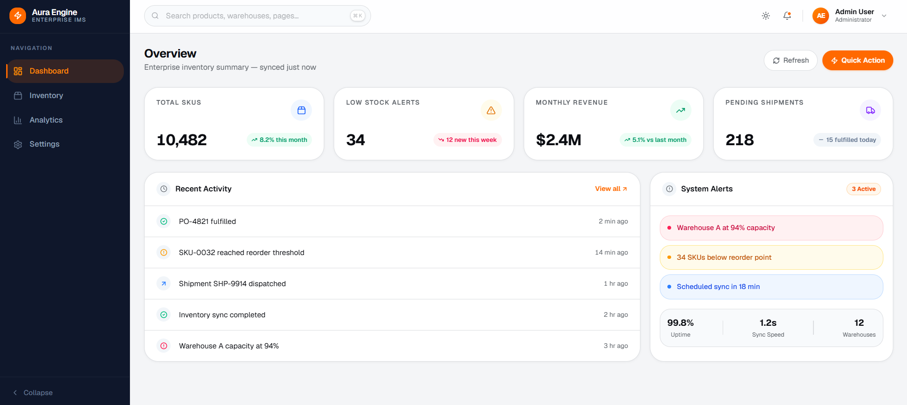
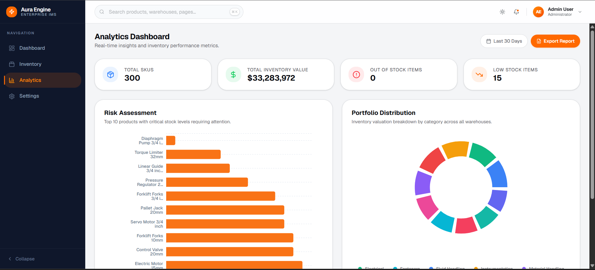
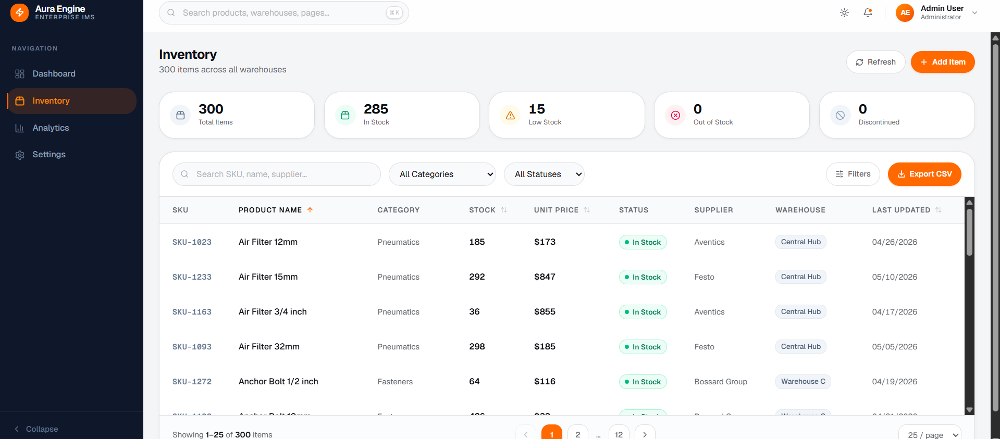
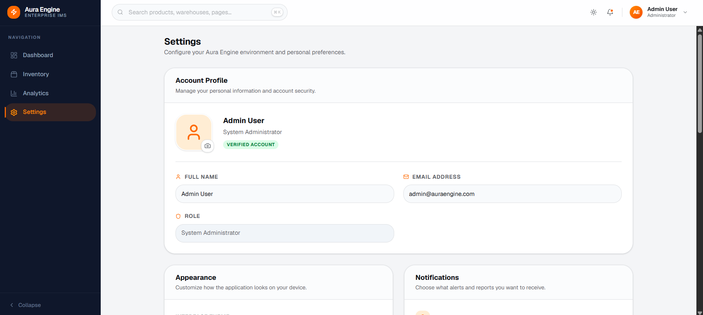

# 📦 Aura Engine – Enterprise Inventory Management System

## 📸 Project Preview

🔗 Live Demo: [https://aura-engine-seven.vercel.app/](https://aura-engine-seven.vercel.app/)

### 🖥️ Dashboard Overview


### 📊 Analytics & Reporting


### 📦 Inventory Management


### ⚙️ System Settings


---

Aura Engine is a **modern enterprise inventory management dashboard** built for high-volume warehouse and logistics operations.

The project focuses on creating a **high-performance ERP-style frontend system** capable of handling large datasets efficiently through advanced filtering, pagination, analytics visualization, and CSV export functionality.

Inspired by real-world logistics and warehouse management workflows, the platform delivers a professional SaaS/ERP experience with scalable frontend architecture.

---

## 🚀 Features

### ✅ Enterprise Inventory Data Grid

* High-performance inventory management table
* Server-side style pagination architecture
* Handles hundreds of inventory records efficiently
* Sticky table headers for improved usability
* Sortable columns (Price, Stock, SKU, etc.)
* Real-time inventory statistics cards

### ✅ Advanced Filtering System

* Category-based filtering
* Status filtering
* Stock-level filtering
* Price range filtering
* Combined multi-filter support

### ✅ Debounced Global Search

* Enterprise-style omnisearch experience
* 500ms debounced search implementation
* Prevents excessive filtering/render cycles
* Fast SKU/product/supplier search experience

### ✅ Analytics Dashboard

* Built using **Recharts**
* KPI summary cards
* Inventory valuation analytics
* Risk assessment charts
* Portfolio/category distribution visualizations
* Dynamic reporting filters

### ✅ CSV Export Module

* Export currently filtered inventory data
* CSV generation handled entirely on frontend
* Professional file naming system
* Supports filtered/sorted dataset exports

### ✅ Enterprise Settings Module

* Appearance preferences
* Notification preferences
* Inventory defaults
* Currency and date format selection
* Theme customization
* Persistent local settings state

### ✅ Professional ERP UI/UX

* SAP/ERP-inspired layout architecture
* Responsive enterprise dashboard
* Modern sidebar navigation
* Command palette search (Ctrl + K)
* Clean SaaS-style design system

---

## 🧠 Key Design Decisions

* **Scalable Architecture**: Feature-based folder structure for maintainability.
* **Performance-Focused UI**: Pagination, debounced search, and optimized rendering patterns.
* **Enterprise UX**: Inspired by real-world ERP systems and logistics dashboards.
* **Reusable Components**: Modular React components and reusable hooks.
* **Frontend-Only Simulation**: Simulates enterprise backend workflows without requiring a backend service.
* **State Persistence**: Local storage used for user settings and preferences.

---

## 📂 Project Structure

```text
Aura_Engine/
│
├── public/                     # Static assets
│
├── src/
│   ├── app/                    # Next.js App Router pages
│   │   ├── (dashboard)/
│   │   │   ├── analytics/
│   │   │   ├── inventory/
│   │   │   ├── settings/
│   │   │   ├── layout.tsx
│   │   │   └── page.tsx
│   │
│   ├── components/
│   │   ├── layout/             # Sidebar, header, shell
│   │   └── shared/             # Shared reusable UI
│   │
│   ├── features/
│   │   ├── analytics/
│   │   ├── inventory/
│   │   └── settings/
│   │
│   ├── hooks/                  # Custom reusable hooks
│   ├── services/               # Utility services
│   ├── mock/                   # Mock enterprise dataset
│   ├── types/                  # TypeScript types
│   └── lib/                    # Shared helpers/utilities
│
├── README.md
├── prompts.md
└── package.json
```

---

## 🛠️ Technologies Used

### Frontend

* Next.js 15 (App Router)
* React
* TypeScript
* Tailwind CSS
* shadcn/ui

### Charts & Visualization

* Recharts

### Utilities & Libraries

* Lucide React
* clsx
* tailwind-merge
* date-fns

### Deployment

* Vercel

---

## 🧪 How to Run the Project

1. **Clone the repository**

```bash
git clone <repository-url>
cd Aura_Engine
```

2. **Install dependencies**

```bash
npm install
```

3. **Start development server**

```bash
npm run dev
```

4. **Open in browser**

```text
http://localhost:3000
```

---

## ⚡ Core Enterprise Features Demonstrated

### Performance Optimization

* Debounced search architecture
* Pagination-based rendering
* Optimized table interactions
* Sticky table headers

### Enterprise Data Handling

* Large mock inventory dataset
* Multi-filter architecture
* Dynamic sorting system
* CSV export pipeline

### Professional Dashboard Experience

* Analytics visualizations
* KPI reporting
* Settings management
* Command palette navigation

---

## 🤖 AI Assistance Disclaimer

AI tools were used for:

* UI architecture planning
* Folder structure guidance
* Enterprise UX refinement
* Hook optimization patterns
* Analytics dashboard structuring
* CSV export implementation guidance

All features were manually integrated, tested, customized, and refined to match the project requirements and enterprise frontend standards.

Detailed AI interaction logs are documented in:

```text
prompts.md
```

---

## 👨‍💻 Author

**Krishna Kumar**
Frontend Developer Intern – Prodesk IT
